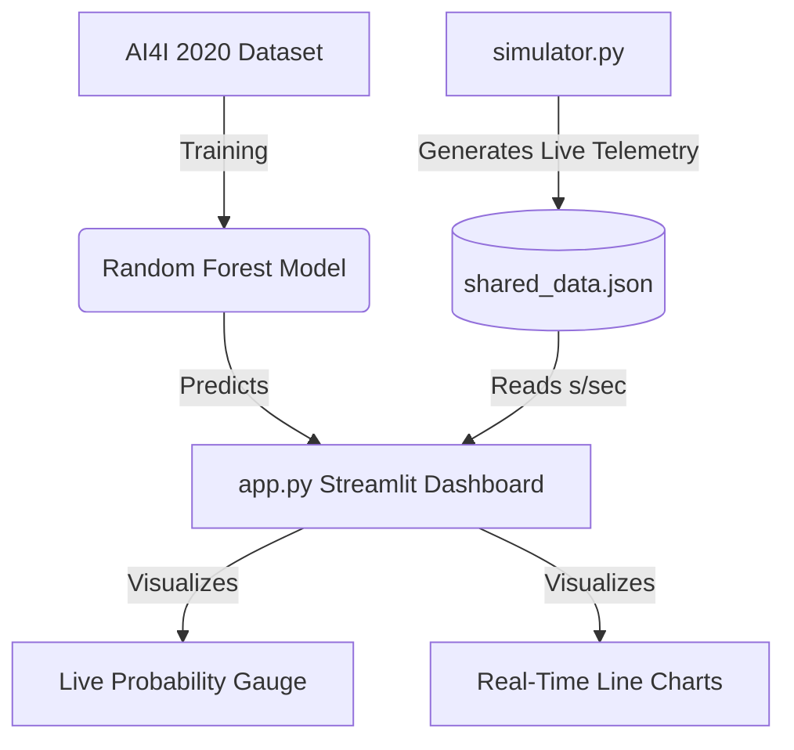

<div align="center">
  
# 🏭 AI-Powered Predictive Maintenance System

**A full-stack, real-time machine learning prediction system for industrial predictive maintenance, built by merging Data Science with Mechatronics Engineering.**

[](https://python.org)
[](https://streamlit.io)
[](https://scikit-learn.org/)
[](https://pandas.pydata.org/)
[](https://plotly.com/)

</div>

---

## 📖 Overview
In modern Industry 4.0 factories, identifying when a machine is going to fail before it actually breaks down can save millions of dollars in downtime and maintenance costs. 

This project simulates real-time machine/sensor telemetry (like Rotational Speed, Torque, Air Temperature, and Tool Wear) and streams it to a live digital-twin dashboard. The Dashboard processes the incoming sensor data point-by-point, dynamically predicting potential failures using an AI Classification model (Random Forest) trained to recognize fault signatures before critical damage occurs.

### ✨ Key Features
* **Machine Learning Engine:** Uses a `Random Forest` classifier trained on the highly cited `AI4I 2020 Predictive Maintenance Dataset`.
* **Sensor Simulation Module:** `simulator.py` creates a live telemetry stream mimicking real PLC/CANbus hardware outputs. Normal operations degrade automatically over time to represent heat/wear physics, publishing continuously to a JSON-based data pipeline.
* **Streamlit Dashboard (`app.py`):** Instantly forecasts **Machine Failure Probability Percentage**, dynamically displaying system architecture analytics accompanied by interactive animated `Plotly` graphs.
* **Process-Safe Data Pipeline:** Engineered a robust read-write thread-safe JSON locking mechanism to ensure stable data flow between the AI background stream and the web interface frontend without port crashes.

---

## ⚙️ Project Architecture



---

## 🚀 Quick Start & Installation

### 1. Requirements
Ensure you have **Python 3.9+** installed on your machine.

```bash
# Clone the repository
git clone https://github.com/your-username/Predictive-Maintenance-System.git
cd Predictive-Maintenance-System

# Create and activate a Virtual Environment (Optional but recommended)
python -m venv venv
# Windows:
.\venv\Scripts\activate
# Linux/Mac:
source venv/bin/activate

# Install all dependencies
pip install -r requirements.txt
```

### 2. Prepare the AI Model
Before running the live simulation, you need to download the global dataset and train the model.
```bash
# 1. Downloads the AI4I Dataset from the UCI Repository
python src/download_data.py

# 2. Extracts Features, Trains and Saves the Random Forest Pipeline 
python src/train_model.py
```

### 3. Run the Digital Twin (End-to-End)
To simulate the physical machine environment, you need two separate terminal windows:

**Terminal 1:** Starts the Dashboard interface.
```bash
streamlit run src/app.py
```

**Terminal 2:** Initializes the equipment (starts generating and sending telemetry signals).
```bash
python src/simulator.py
```

Once both are running, open the provided `Local URL` in your browser, click **"Start Live Tracking"**, and watch as the physics degrade leading into a real-time failure prediction event!

---

## 📁 Repository Structure
```text
Predictive-Maintenance-System/
├── data/                    # Contains downloaded CSV and real-time shared_data.json
├── models/                  # Stores the trained rf_model.joblib parameters
├── notebooks/               # (Optional) Jupyter notebooks for EDA and ML experiments
├── src/
│   ├── app.py               # Streamlit Dashboard (Frontend & Live Inference)
│   ├── download_data.py     # UCI API Dataset Fetcher
│   ├── simulator.py         # Hardware Sensor/PLC Simulator
│   └── train_model.py       # ML Pipeline, Feature Engineering & Modeler
├── requirements.txt         # Project dependencies
└── README.md                # Project documentation
```

---

## 🤝 Contribution
Contributions, issues, and feature requests are welcome! 
Feel free to check [issues page](https://github.com/your-username/Predictive-Maintenance-System/issues) if you want to contribute.

## 📝 License
This project is open-source and available under the [MIT License](LICENSE).
