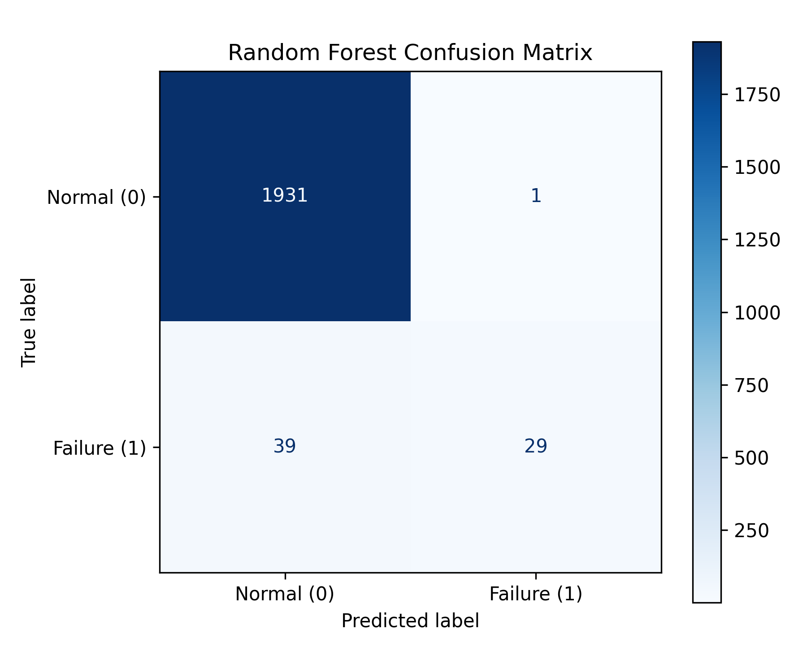
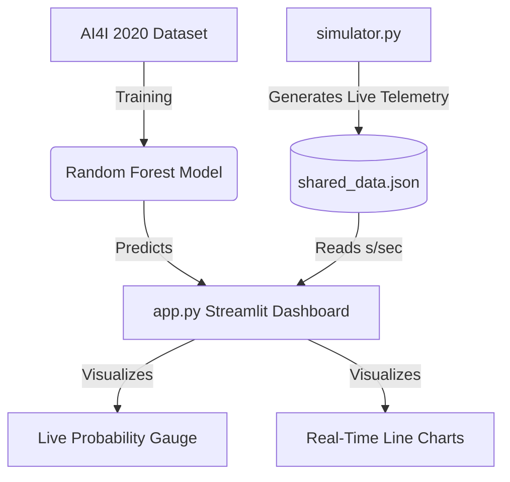

<div align="center">
  
# 🏭 AI-Powered Predictive Maintenance System

**A full-stack, real-time machine learning prediction system for industrial predictive maintenance, built by merging Data Science with Mechatronics Engineering.**

[](https://python.org)
[](https://streamlit.io)
[](https://scikit-learn.org/)
[](https://pandas.pydata.org/)
[](https://plotly.com/)

</div>

---

## 📖 Overview
In modern Industry 4.0 factories, identifying when a machine is going to fail before it actually breaks down can save millions of dollars in downtime and maintenance costs. 

This project simulates real-time machine/sensor telemetry (like Rotational Speed, Torque, Air Temperature, and Tool Wear) and streams it to a live digital-twin dashboard. The Dashboard processes the incoming sensor data point-by-point, dynamically predicting potential failures using an AI Classification model trained to recognize fault signatures before critical damage occurs.

<br>

<div align="center">
  

  
</div>

<br>

---


## 🔬 Technical Deep Dive & Code Architecture

The underlying structure of this system is split into multiple highly-decoupled modules focusing on robust data pipelines and ML inference.

### 1. The Machine Learning Engine (`train_model.py`)
At the core of our predictions lies the `AI4I 2020 Predictive Maintenance Dataset`.
* **Feature Engineering:** Unique identifiers and specific failure subtypes (like TWF, HDF) are dropped to prevent target leakage. Categorical parameters like Machine Quality `Type` (L, M, H) are transformed using `OneHotEncoder`.
* **Imbalance Handling:** In real-world data, physical failures are rare anomalies. We tackle this distribution imbalance using `class_weight='balanced'` within the `RandomForestClassifier` pipeline.
* **Pipeline Export:** The fully fitted `StandardScaler` and `RandomForest` are bundled together via `sklearn.pipeline` and serialized using `joblib` into the `models/` directory for live inference.

#### Model Evaluation & Algorithm Selection
During the development phase, we evaluated multiple classification algorithms to determine the best fit for this specific industrial dataset. While Logistic Regression struggled with the non-linear relationships of sensor data, **XGBoost** and **Random Forest** performed exceptionally well. We ultimately selected the Random Forest Classifier because it offered the most stable **F1-Score** against the imbalanced minority class (actual failures) while maintaining a lower risk of overfitting on unseen sensor noise compared to XGBoost.

| Metric | Score | Note |
| --- | --- | --- |
| **Accuracy** | 98.0% | Overall correct predictions |
| **F1-Score** | 0.59 | Harmonic mean of Precision and Recall on the minority (failure) class |
| **Precision** | 0.97 | When it predicts failure, it is 97% correct |
| **Recall** | 0.43 | Ability to catch actual failures amidst normal operations |

<br>



</div>

<br>

### 2. Live Telemetry Simulator (`simulator.py`)
To mimic a real physical PLC (Programmable Logic Controller) or a SCADA system, this script acts as an eternal publisher.
* **Natural Degradation Physics:** It generates initial stable parameters and slowly adds Gaussian noise to heat and torque profiles. 
* **Anomaly Triggers:** After a specific epoch threshold, the machine begins to deliberately overexert—rotational speed drops, torque spikes, and process temperature climbs rapidly.
* **Data Pipeline:** Instead of locking network ports (like UDP) which often fail in multi-threaded UI environments, it safely writes continuous JSON telemetry to `data/shared_data.json` at 1Hz frequency.

### 3. Real-Time Inference Dashboard (`app.py`)
Developed with **Streamlit**, this is the central nervous system aggregating AI predictions and raw data.
* **Daemon Threads & Mutex Locks:** Standard Streamlit runs sequentially triggering whole-script reloads. To stream live data smoothly without crashing the visualization, we engineered an isolated `threading.Thread`. It asynchronously reads incoming parameters, feeds them into the serialized `rf_model`, and caches the last 50 states using robust `threading.Lock()` controls.
* **Dynamic Visualization:** Uses `Plotly Graph_Objects` to render beautiful animated gauges indicating failure probability (%), and multi-line time-series telemetry charts to pinpoint exactly *when* the physics started breaking down.



---

## 🚀 Quick Start & Installation

Clone the repository and install dependencies using Python 3.9+:

```bash
git clone https://github.com/enesuslu15/AI-Powered-Predictive-Maintenance-System.git
cd AI-Powered-Predictive-Maintenance-System
pip install -r requirements.txt
```

### Run the System
Fetch the dataset, train the model, and launch the digital twin interface:

```bash
# 1. Prepare Data and Train Model
python src/download_data.py
python src/train_model.py

# 2. Start the Frontend Dashboard (Terminal 1)
streamlit run src/app.py
```
*Open the provided Local URL (`http://localhost:8505`) in your browser. The dashboard will wait for live data.*

```bash
# 3. Trigger the Machine Simulator (Terminal 2)
python src/simulator.py
```
*As soon as the simulator starts, the dashboard will dynamically plot the real-time telemetry.*

---

## 📁 Repository Structure
```text
Predictive-Maintenance-System/
├── data/                    # Contains downloaded CSV and real-time shared_data.json
├── models/                  # Stores the trained rf_model.joblib parameters
├── src/
│   ├── app.py               # Streamlit Dashboard (Frontend & Live Inference)
│   ├── download_data.py     # UCI API Dataset Fetcher
│   ├── simulator.py         # Hardware Sensor/PLC Simulator
│   └── train_model.py       # ML Pipeline, Feature Engineering & Modeler
├── requirements.txt         # Project dependencies
└── README.md                # Project documentation
```

---

## 🤝 Contribution & License
Contributions, issues, and feature requests are welcome! 
This project is open-source and available under the [MIT License](LICENSE).

